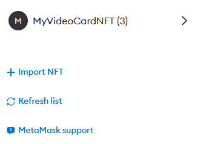

Вначале устанавливаем все пакеты
```
npm install
```

Затем в **hardhat.config.js** нужно прописать "INFURA SEPOLIA HTTPS END POINT" и ["METAMASK PRIVATE KEY"](https://support.metamask.io/vi/managing-my-wallet/secret-recovery-phrase-and-private-keys/how-to-export-an-accounts-private-key). Вместо Infura я использую Alchemy

```
const HTTPS_ENDPOINT = "https://eth-sepolia.g.alchemy.com/v2/{Мой API Key}"
const PRIVATE_KEY = "{Мой MetaMask private key}"

```

После этого компилируем
```
npx hardhat compile
```

Деплоим
```
npx hardhat run scripts/deploy.js --network sepolia
```

Получаем адрес смарт контракта, который можно проверить на https://sepolia.etherscan.io/

Теперь загружаем картинки вручную в IPFS. Можно воспользоваться их официальным приложением, но я буду использовать сервис [Pinata](https://www.pinata.cloud/).


После загрузки получаем адрес каждой картинки и прописываем его в поле **PINATA_IPFS_IMAGE_URI** соответсвующего файла метаданных *\*-nft-metadata.json*, которые находятся в папке **utils**.

Например, *box-nft-metadata.json*
```
{
    ...
    "image": "https://lavender-neighbouring-gibbon-421.mypinata.cloud/ipfs/QmZu6nSKxoZvCVty14Zw5j6ozNUsnSpfqs3xPmebkoRo4v"
    ...
}
```

Так же загружаем файлы метаданных в Pinata


Прописываем значения переменных в файле *mint-myvc-nfts.js*

- MY_VIDEO_CARD_TOKEN_ADDRESS - адрес смарт контракта
- API_KEY - ключ Infura или Alchemy
- PRIVATE_KEY - MetaMask private key
- PINATA_IPFS_URI - по очереди будем менять на url файлов метаданных

После этого нужно три раза запустить этот скрипт с различными адресами файлов метаданных в PINATA_IPFS_URI

```
npx hardhat run scripts/mint-myvc-nfts.js --network sepolia
```

Теперь загрузим получившиеся токенты в MetaMask. Переходим во вкладку NFT, жмём Import, вводим адрес нашего смарт контракта и номер токена. У нас всего три токена и их номера 0, 1, 2 соответственно.


В кошельке появится новая коллекция **MyVideoCardNFT**



Если её раскрыть, выбрать любой токен и нажать *View in OpenSea*, то откроется сайт https://testnets.opensea.io с нашим токеном


